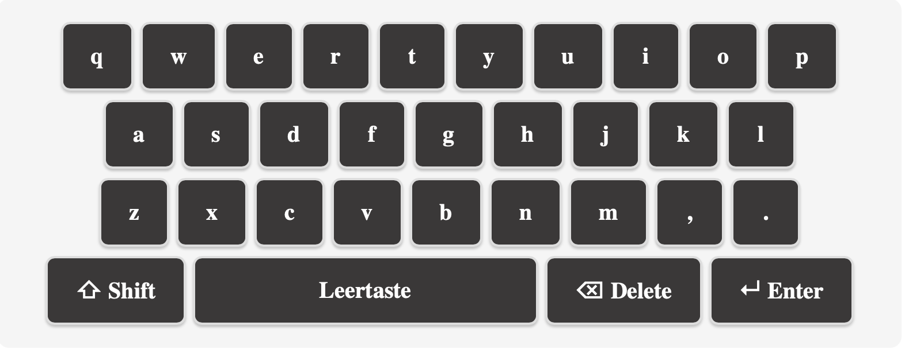
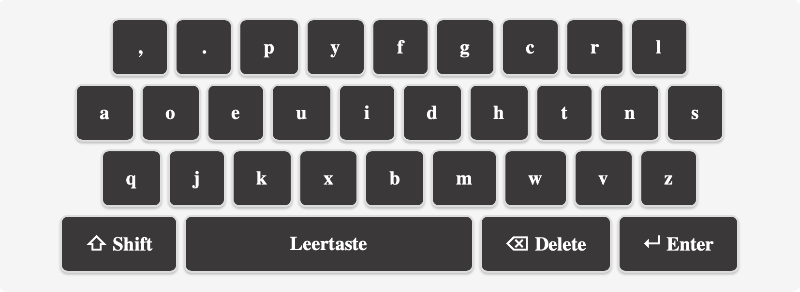
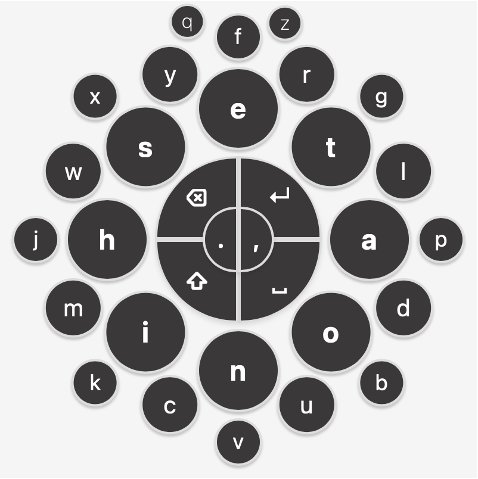

```{r setup, include=FALSE}
knitr::opts_chunk$set(echo = FALSE)
library(tidyr)
library(dplyr)
results <- read.csv("../data/results.csv", sep=",", header=TRUE)
```
## Implementation


## Keyboard Design - Qwerty


## Keyboard Design - Dvorak


## Keyboard Design - Circle


## Descriptive Stats - Objective


--- 


## Descriptive Stats- Subjective

```{r, echo=FALSE}
# Read NASA-TLX data
nasa <- read.csv("../data/nasaTLX.csv")
nasa$layout <- factor(nasa$layout)

# Save boxplots as PDF using LaTeX-compatible fonts
par(mfrow=c(1,2))
boxplot(mental_demand ~ layout, data=nasa, main="Mental Demand")
boxplot(physical_demand ~ layout, data=nasa, main="Physical Demand")
```

## Descriptive Stats- Subjective

```{r, echo=FALSE}
par(mfrow=c(1,3))
boxplot(performance ~ layout, data=nasa, main="Performance")
boxplot(effort ~ layout, data=nasa, main="Effort")
boxplot(frustration ~ layout, data=nasa, main="Frustration")
par(mfrow=c(1,1))
```

## Inferential Stats
WPM:
```{r, echo=FALSE}
# Add participant ID
results$id <- 1:nrow(results)

# --- WPM Long Format ---
wpm_long <- results %>%
  select(id, qwerty_wpm, dvorak_wpm, circle_wpm) %>%
  pivot_longer(
    cols = -id,
    names_to = "layout",
    values_to = "wpm"
  )

wpm_long$id <- factor(wpm_long$id)

wpm_long$layout <- factor(wpm_long$layout,
                         levels=c("qwerty_wpm","dvorak_wpm","circle_wpm"),
                         labels=c("QWERTY","DVORAK","CIRCLE"))

# --- RM ANOVA for WPM ---
anova_wpm <- aov(wpm ~ layout + Error(id/layout), data=wpm_long)

wpm_tab <- summary(anova_wpm)[[2]][[1]]

wpm_effect <- wpm_tab["layout", , drop=FALSE]

wpm_effect$`Pr(>F)` <- "$p< .001$"

colnames(wpm_effect) <- c("Df", "Sum Sq", "Mean Sq", "F value", "p-value")
wpm_effect
```

TER:
```{r,  echo=FALSE}

# --- TER Long Format ---
ter_long <- results %>%
  select(id, qwerty_ter, dvorak_ter, circle_ter) %>%
  pivot_longer(
    cols = -id,
    names_to = "layout",
    values_to = "ter"
  )

ter_long$id <- factor(ter_long$id)

ter_long$layout <- factor(ter_long$layout,
                         levels=c("qwerty_ter","dvorak_ter","circle_ter"),
                         labels=c("QWERTY","DVORAK","CIRCLE"))

# --- RM ANOVA for TER ---
anova_ter <- aov(ter ~ layout + Error(id/layout), data=ter_long)
ter_tab <- summary(anova_ter)[[2]][[1]]

ter_effect <- ter_tab["layout", , drop=FALSE]

colnames(ter_effect) <- c("Df", "Sum Sq", "Mean Sq", "F value", "p-value")
ter_effect
```

## Post-Hoc
```{r, echo=FALSE, message=FALSE}

library(emmeans)

emm_wpm <- emmeans(anova_wpm, ~ layout)

posthoc <- pairs(emm_wpm, adjust = "bonferroni")
posthoc_df <- as.data.frame(posthoc)

posthoc_df <- posthoc_df %>%
  mutate(p.value = ifelse(p.value < 0.001, "$<0.001$", sprintf("%.3f", p.value)))

posthoc_df
```